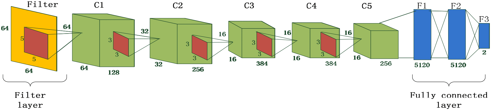

# Media-Filtering-Forensics_DL
 Caffe implementation of [Median Filtering Forensics Based on Convolutional Neural Networks](https://ieeexplore.ieee.org/abstract/document/7113799).  
 PDF version in [here](./demo/pdf/07113799.pdf).
 
 ## How to use
 **Requirments**: [Caffe toolbox](http://caffe.berkeleyvision.org/)  
 **To train the CNNs**: 
    ``` sh train_full.sh ```


## Citation
Please cite this paper in your publications if it helps your research:

    @article{chen2015median,
    title={Median filtering forensics based on convolutional neural networks},
    author={Chen, Jiansheng and Kang, Xiangui and Liu, Ye and Wang, Z Jane},
    journal={IEEE Signal Processing Letters},
    volume={22},
    number={11},
    pages={1849--1853},
    year={2015},
    publisher={IEEE}
    }
---
## Appendix:
The net struct for median filtering forensics:
